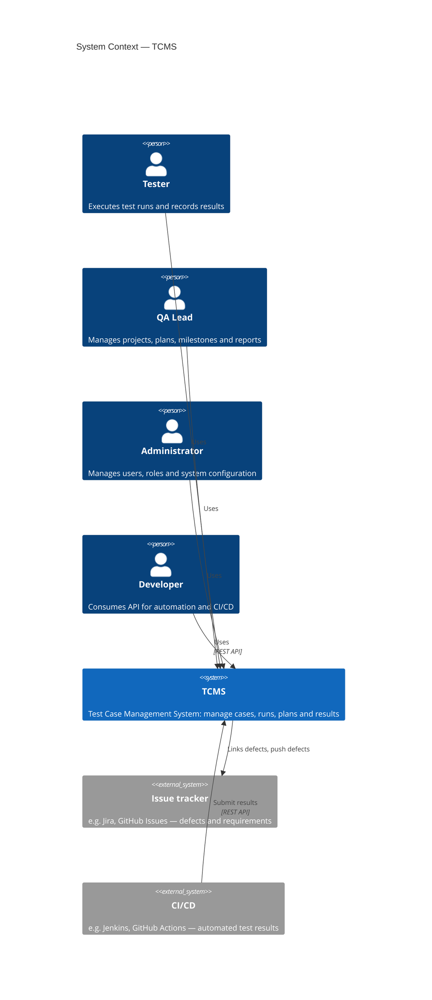
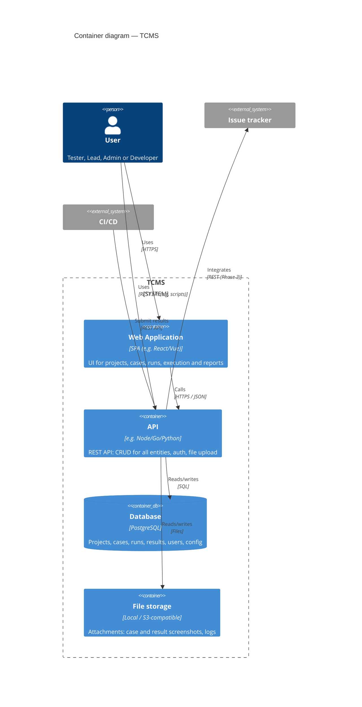
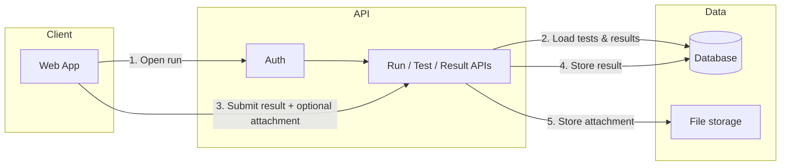

# TCMS — Architecture

This document describes the chosen approach for architecture documentation and the high-level architecture of the Test Case Management System (TCMS). It aligns with [REPLICATION_PLAN.md](../REPLICATION_PLAN.md).

---

## 1. Tools for architecture

### 1.1 Recommended approach

| Purpose | Tool | Why |
|--------|-----|-----|
| **Architecture model** | [C4 Model](https://c4model.com/) | Industry-standard levels (Context → Container → Component → Code); keeps diagrams consistent and scoped. |
| **Diagrams** | [Mermaid](https://mermaid.js.org/syntax/c4.html) (C4 syntax) | Text-as-code: version-controlled, reviewable in PRs, no binary files. Renders in GitHub, GitLab, and most static docs. |
| **Docs location** | Markdown in repo (`docs/`) | Single source of truth; links from README and REPLICATION_PLAN. |

### 1.2 Alternatives

- **Structurizr (DSL)** — C4 as code with multiple views; good if you want strict C4 and export to PlantUML/diagrams. Heavier setup.
- **Draw.io / Lucidchart** — Visual editing; export to SVG/PNG and commit. Better for one-off diagrams; weaker for “single source” and diffing.
- **PlantUML** — Text-based; strong for sequences and class diagrams; C4 possible via C4-PlantUML. Requires render step.

**Recommendation:** Use **C4 + Mermaid** in this repo for all phase-level architecture diagrams. Add Structurizr or Draw.io later if you need extra views or hand-drawn visuals.

### 1.3 C4 levels used here

- **Level 1 — System Context:** TCMS and its users / external systems (no internals).
- **Level 2 — Container:** Main building blocks (Web App, API, Database, File Storage).
- **Level 3 — Component:** (Future) Inside the API or Web App when detailing modules.

---

## 2. System Context (Level 1)

Who uses TCMS and which external systems it talks to.

---

## 3. Container diagram (Level 2)

High-level building blocks and technology choices. Stack is illustrative (SPA + API + Postgres + file store); swap components as needed.

---

## 4. High-level data flow (execution path)

How a “run test and record result” flow moves through the system. Optional view to keep in mind when designing API and DB.

---

## 5. Technology choices (summary)

Decisions are left open in [REPLICATION_PLAN.md](../REPLICATION_PLAN.md); this table is a placeholder for when you lock them in.

| Layer | Options | Notes |
|-------|---------|--------|
| **Web App** | React, Vue, Svelte | SPA; consider SSR later for SEO if needed. |
| **API** | Node (Express/Fastify), Go (Echo/Gin), Python (FastAPI) | REST; stateless; session or JWT. |
| **Database** | PostgreSQL | JSONB for custom case fields; full-text search optional. |
| **File storage** | Local filesystem, MinIO, S3 | For attachments. |
| **Auth** | Session + cookie, JWT | Phase 1–2; SSO/MFA in Phase 4. |
| **Diagrams** | Mermaid (C4) in repo | As in this document. |

---

## 6. Document history

| Date | Change |
|------|--------|
| 2025-03-05 | Initial architecture: tooling, C4 Context/Container, data flow, tech summary. |

---

*Update this document when you add Component-level diagrams or change container boundaries or external systems.*
